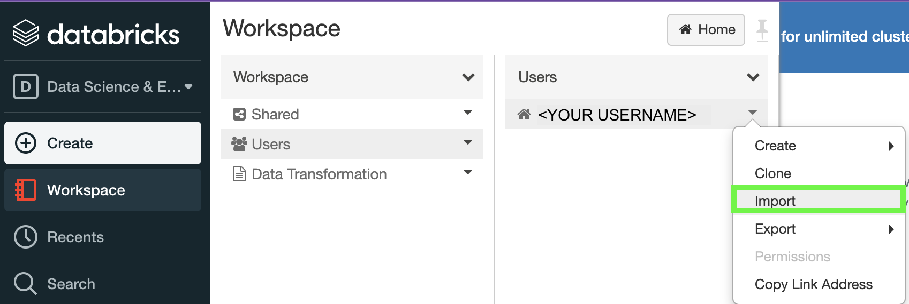
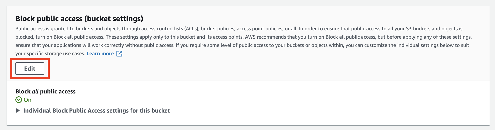
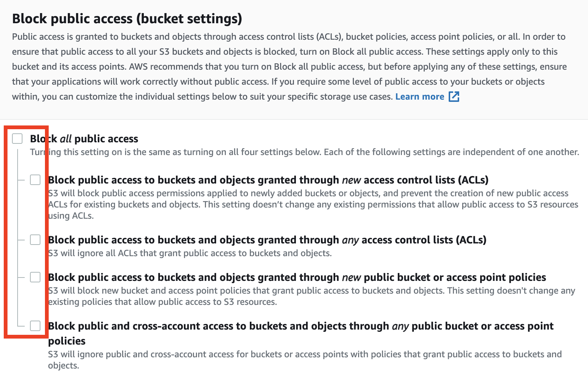
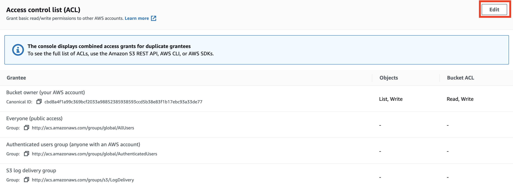
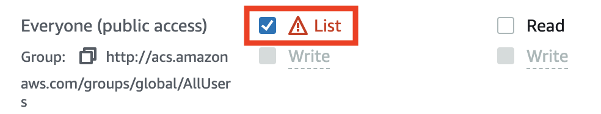
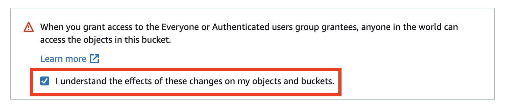

# CO2 vs. Temperature (Visualisation)
In this exercise, we assume that you've completed the [production-code](https://github.com/data-derp/exercise-co2-vs-temperature-production-code) and have managed to push those artifacts to an AWS S3 Bucket. If not, see [Fresh Start](#fresh-start). This exercise focuses on using those artifacts as part of an AWS Glue workflow.

**NOTE:** The following exercises follow the same concept as [the production-code exercise](https://github.com/data-derp/exercise-co2-vs-temperature-production-code) where a `project-name` and `module-name` are used consistently to create resources.

In all examples in ,
* `project-name` = **awesome-project**
* `module-name` = **awesome-module**

Where these are used, you'll want to pick your own unique `project-name` and `module-name`.

## Prerequisites
* An AWS Account and IAM User with permissions to create AWS Glue and Athena resources and read S3 buckets
* [AWS CLI access](https://docs.aws.amazon.com/cli/latest/userguide/cli-chap-configure.html))

## Quickstart
1. [Make your bucket public](#make-your-bucket-public)
2. Open [Data Visualisation CO2 vs Temperature.dbc](./Data%20Visualisation%20CO2%20vs.%20Temperature.dbc) in [Databricks Community Edition](https://community.cloud.databricks.com/)
   
3. Follow instructions in Notebook

## Fresh Start
If you don't have the artifacts in an S3 bucket yet:
1[Ensure you have an active AWS CLI Session in your Terminal](https://docs.aws.amazon.com/cli/latest/userguide/cli-chap-configure.html))
2[Create an S3 bucket](https://github.com/data-derp/s3-bucket-aws-cloudformation)
3. Upload the transformed data:
```bash
# Change these variables
PROJECT_NAME=awesome-project
MODULE_NAME=awesome-module

./go upload-data "${PROJECT_NAME}-${MODULE_NAME}"
```

## Make Your Bucket Public
In most scenarios, your bucket containing data should NOT be public (open to the entire internet) unless your use case deems it appropriate.

1. In the **AWS Console**, navigate to your bucket and click the **Permissions** tab.
2. Click **Edit** under **Block Public Access**
    
3. Uncheck everything
   
4. Under the **Bucket Policy**, click **Edit** and paste the following policy (don't forget to change <YOUR BUCKET NAME>):
```json
{
    "Version": "2012-10-17",
    "Statement": [
        {
            "Sid": "AllowPublicRead",
            "Principal": "*",
            "Effect": "Allow",
            "Action": ["s3:GetObject"],
            "Resource": ["arn:aws:s3:::<YOUR BUCKET NAME>/*"]
        }
   ]
}
```
5. Under the **Access Control List (ACL)**:

   

   

   
    

